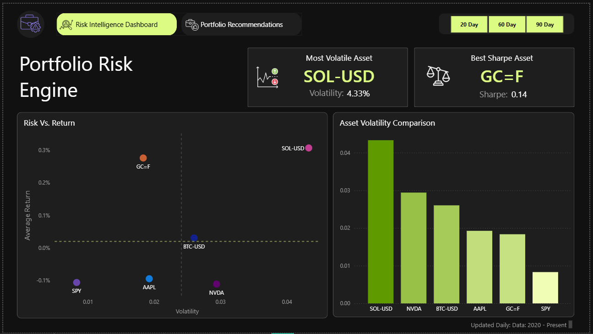
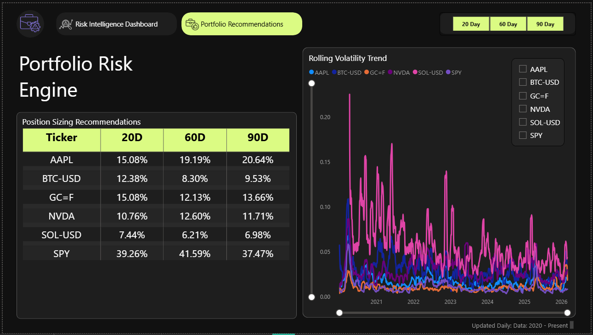

# Portfolio Risk Engine

Most investors track what their assets are worth. Few track whether the risk they're taking is actually worth the return. The Portfolio Risk Engine bridges that gap — an automated data pipeline that calculates volatility-adjusted metrics and position size recommendations across your entire portfolio, so you always know if the reward justifies the risk.

## Dashboard

### Risk Intelligence


### Portfolio Recommendations


## Architecture

The architecture takes shape in 3 layers:

**Bronze:** The ingestion staging layer. Holds the raw prices fetched from the yfinance API and stores them as-is.

**Silver:** The cleaning layer. Solves duplication problems and calculates the daily return of each asset.

**Gold:** The decision layer. Holds the logic for calculating volatility, risk metrics, and position size recommendations for each asset across 20, 60, and 90 day windows.

## Stack

- **Python** — handles data fetching and ingestion into BigQuery
- **BigQuery** — data warehouse where all three architecture layers live
- **dbt** — structures and manages the SQL transformation pipeline
- **GitHub Actions** — automates the entire pipeline on a nightly schedule
- **Power BI** — dashboard layer for risk intelligence and portfolio recommendations


## How It Works

The Python script authenticates with a BigQuery client so fetched data knows where to go. Daily closing prices for each asset are pulled from Yahoo Finance via the yfinance API and ingested into the Bronze layer.

From Bronze, data is cleaned and transformed in the Silver layer — deduplication is handled and daily returns are calculated. This feeds into the Gold layer where the core risk engine metrics are derived: rolling volatility, average returns, Sharpe Ratios, and position size recommendations across three time windows.

dbt orchestrates the Silver and Gold transformations, and GitHub Actions runs the entire pipeline automatically every night at 1am UTC.

## Setup

### Prerequisites
- Python 3.13+
- Google Cloud account with BigQuery enabled
- A GCP service account with BigQuery Data Editor and Job User roles
- dbt-bigquery installed
- Power BI Desktop

### Steps

1. Clone the repository
```
git clone https://github.com/Manuelkreate/portfolio-risk-engine.git
```

2. Create a virtual environment and install dependencies
```
pip install yfinance pandas google-cloud-bigquery db-dtypes pandas-gbq dbt-bigquery
```

3. Add your GCP service account JSON key to a `credentials/` folder

4. Run the ingestion script
```
python ingestion/fetch_prices.py
```

5. Run dbt transformations
```
cd portfolio_risk_engine
dbt run
```

6. Open `visualization/portfolio_risk_engine_dashboard.pbix` in Power BI Desktop

## Assets Tracked

| Ticker | Asset |
|--------|-------|
| AAPL | Apple Inc. |
| NVDA | NVIDIA Corporation |
| SPY | S&P 500 ETF |
| BTC-USD | Bitcoin |
| SOL-USD | Solana |
| GC=F | Gold Futures |

## Key Concepts

| Metric | What It Tells You |
|--------|------------------|
| Rolling Volatility | How unpredictable an asset has been over 20, 60, or 90 days |
| Sharpe Ratio | Whether the return justifies the risk (above 1 is good, negative means T-bills are better) |
| Position Size | Recommended portfolio weight based on volatility parity |
